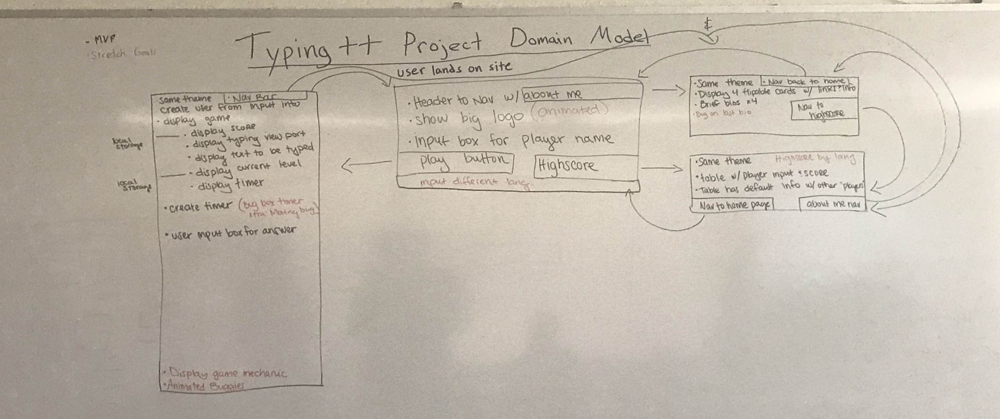

The project plan document should contain the following information:

Your team's name (if you want one)
- Team Aquamarime 

Your team's members
- Alex Hanson, Connor Crossley, Sharon Miller, Megan Ivey

Your project's name and concept
- Typing ++ - a typing app for developers to improve their code typing dexterity.

A diagram of your project's domain model (we'll do a sample in class)

An exhaustive explanation of how your team plans to address details in the problem domain, ideally to the detail level of listing the data collections and functions you'll need.
- Object for housing user objects
- Constructor function for each user
  - Name
  - Level
  - High Score
  - Method - push to collection object
  - Method - calculate score
  - Local storage
- Level Object
  - level
  - prompt text example array
  - Timer
  - Local storage
  - Render()
- Text Input Object/Function?
  - Render ()
  - Take input()
  - Parse out the prompt()
  - Check input against prompt()
  - Checks against timer()
- Object for high score table 
  - Local storage
  - render ()
  - Array of names and scores 
- About us in HTML/CSS animation
- For home page
  - Form 
  - High score form = link
  - Listener/Handler for name input

What we need:
Spike of the timer
Functionality - imput needs to do something (shake, beep etc when you make mistake) - password validation shake
Stretch goal - 5th page, someone can add their own text and it builds a level. 
Show off user stories during presentation
show off graph from gitHub

Sketches/wireframes of your project's pages
https://xd.adobe.com/view/66644221-06b2-4bc3-7a93-a1429c7db770-1055/

NOTE: You should not be writing any code prior to the approval of the project plan.
TIP: Use pencil and paper to diagram and sketch. Online tools look snazzy but take some time to learn.